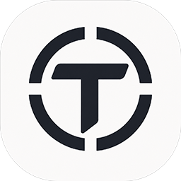

<!--  -->
<div align="center">

<div>
    
</div>

# Tessera

<p>
  <strong>All-in-one LLM client. Make a multimodal AI yourself.</strong>
</p>

<p>
  <em>Your own multimodal AI assistant — powered by the models you choose, running on every device you own.</em>
</p>


[](https://flutter.dev/)
[](https://dart.dev/)
[](https://github.com/NaivG/tessera/releases)
[](LICENSE)

<p>
  <a href="#features">Features</a> •
  <a href="docs/en/">Documentation</a> •
  <a href="#quick-start">Quick Start</a> •
  <a href="#screenshots">Screenshots</a> •
  <a href="#license">License</a>
</p>

<p style="font-size: 1.1em;">
  <a>English</a> |
  <a href="README_ZH.md">中文文档</a>
</p>

</div>

---

**Tessera** (τέσσερα, Greek for "four") is a cross-platform AI chat client built with Flutter. It unifies multiple LLM providers under one interface and seamlessly routes multimodal tasks — vision, audio, image generation, speech — to the right models. An experimental long-term memory system extracts, retrieves, compresses, and forgets like a human mind.

---

## Features

- **🤖 Multi-Provider LLM Access** — OpenAI, Anthropic, Google AI, Ollama. Each provider keeps its own API key, base URL, and model config.
- **🔄 Streaming Conversations** — Token-by-token responses with full Markdown rendering and syntax-highlighted code blocks.
- **🧠 Capability Adapter System** — Automatically routes vision, audio, image generation, and TTS tasks to specialized sub-models via function-calling.
- **💾 Intelligent Prompt Caching** — Three-block system prompt with SHA256 delta caching; only changed blocks are re-sent.
- **🧠 Long-Term Memory** — SimHash-based semantic search, DBSCAN clustering with LLM compression, exponential-decay forgetting, and rolling conversation summaries.
- **🧩 Extensible Plugin System** — Sandboxed Lua 5.3 runtime. Write a script, register tools and skills — no rebuild needed.
- **🎤 Voice Interaction** — Speech-to-text input and text-to-speech output.
- **📚 Conversation Management** — SQLite persistent storage, create/rename/delete, media library.
- **🎨 User Experience** — Material 3 design, light/dark theme, desktop window management, streaming Markdown with code highlighting.
- **🌐 Localization** — Fully localized in English and Chinese, extensible via Flutter l10n.

See [**Documentation**](docs/en/) for deep-dive architecture, tech stack, project structure, and subsystem references.

---

## Quick Start

### Prerequisites

- [Flutter SDK](https://docs.flutter.dev/get-started/install) 3.11+
- Platform-specific build tools (Xcode, Android Studio, Visual Studio, etc.)

### Install & Run

```bash
git clone https://github.com/NaivG/tessera.git
cd tessera
flutter pub get
flutter run
```

Desktop builds auto-configure the window: minimum 400×600, default 480×720, centered.

### Configure APIs & Models

1. Launch the app and navigate to **Settings**
2. Add an LLM provider (OpenAI / Anthropic / Google / Ollama)
3. Enter your API key and optional base URL
4. Configure models for the provider
5. Select your main chat model and specialized models per capability
6. Return to the main page and start a conversation

---

## Documentation

Deep-dive architecture, tech stack, project structure, and subsystem references are in [**docs/en/**](docs/en/):

- [**Plugin System**](docs/en/plugin-system.md) — Lua sandbox, manifest schema, bridge API, distribution format, authoring guide
- [**Memory System**](docs/en/memory-system.md) — SimHash indexing, extraction pipeline, retrieval scoring, DBSCAN + LLM compression, exponential-decay forgetting
- [**LLM Provider Abstraction**](docs/en/llm-providers.md) — Unified `LlmProvider` interface, streaming protocol, structured output with `JsonExtractor`
- [**Capability Adapter**](docs/en/capability-adapter.md) — Multimodal routing architecture, model selection slots, function-call bridging

---

## Screenshots

> *(Coming soon — screenshots of chat, settings, model selection, memory viewer, and media library)*

---

## License

Copyright (C) 2026 NaivG and contributors.

This project is licensed under the **GNU Affero General Public License v3.0** — see the [LICENSE](LICENSE) file for details.

```
This program is free software: you can redistribute it and/or modify
it under the terms of the GNU Affero General Public License as
published by the Free Software Foundation, either version 3 of the
License, or (at your option) any later version.

This program is distributed in the hope that it will be useful,
but WITHOUT ANY WARRANTY; without even the implied warranty of
MERCHANTABILITY or FITNESS FOR A PARTICULAR PURPOSE.  See the
GNU Affero General Public License for more details.

You should have received a copy of the GNU Affero General Public License
along with this program.  If not, see <http://www.gnu.org/licenses/>.
```
